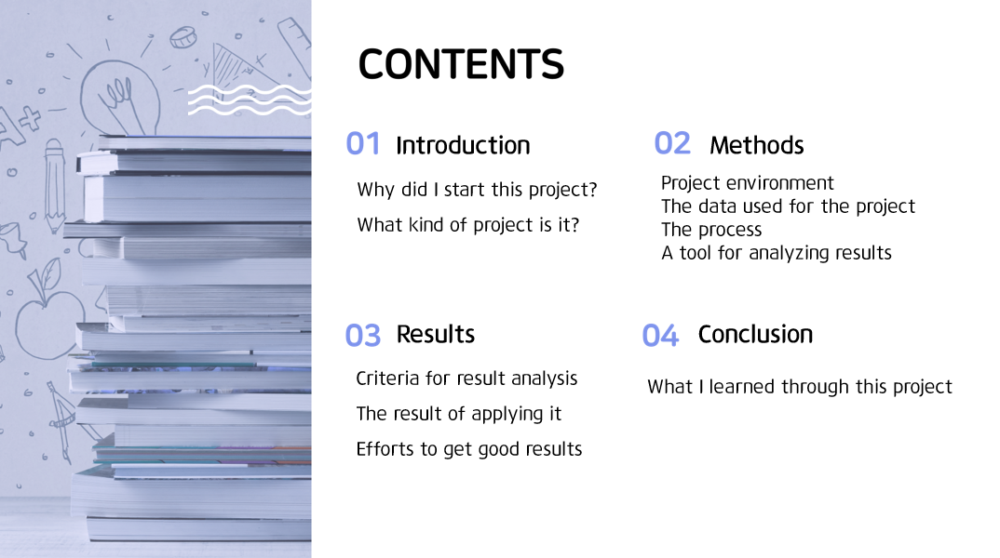

# KoreanFood recognition using yolov5
 

This project was conducted in the fall semester of 2021 as a UNLV internship project. And this project is a personal project with feedback from the professor (Dr. Morrison). We trained the YOLOv5 model using UEC_FOOD_256 data and Korean food data.  
Details of the data and model can be found at the link below.  
[YOLOv5](https://github.com/ultralytics/yolov5) 
[UEC_FOOD_256](http://foodcam.mobi/dataset256.html) 
[Korean food data](https://github.com/heasun0111/KoreanFood-Recognition)   

 
Hello, I'm Hyesun Hong. I am a student at Korea Aerospace University in Korea.  
My major is Computer Science, and I am currently a senior. I came to UNLV in the fall semester of 2021 and worked on the Food Recognition project using YOLOv5. Then I'll start the presentation of the project I've been working on this semester.      

This is the contents, and each part contains the following information.
     

Diet has a lot of influence on health. Bad eating habits cause many diseases And healthy diets make a balanced body.  
Recently, many people use their cell phones to keep a diet journal.  
Then, what if there is a program that automatically labels food from photos And analyzes the diet?  
     

More convenient usage will make it easier for many people to control their diet, save time and increase accessibility. 
In anticipation of these benefits, the food recognition project began. We trained UEC_FOOD_256 data and Korean food data on yolov5, and measured the accuracy of the model through precision, recall, and mAP.
     

The settings for this project are as follows.  
Use MobaXterm to remotely connect to the AI server. And build a virtual environment using miniconda. Miniconda makes it easy to create multiple virtual environments and to install libraries needed for projects. Machine learning training takes a lot of time, but if the session is disconnected, training will be stopped. To solve this problem, use tmux to multiplex the console so that training continues even when the session is closed.
     

The datasets are as follows.  
There are two types of data, UEC_FOOD_256 data and Korean Food data. The UEC_FOOD_256 dataset consists of 256 kinds of Japanese food and other countries' food, with 100~600 images per category. This dataset is open-source and could be used without any special conditions. However, the format of UEC_FOOD_256 bounding box and the format of YOLOv5 were different. So conversion was required. We used the ‘food_generate_bbox_file.py’ and ‘food_split_for_yolo.py’ codes found to a format suitable for YOLOv5.
     

And the Korean food dataset is made by using Roboflow.  
We divided upper categories such as rice/soup/noodles/meat side dishes/vegetables side dishes/fish side dishes/kimchi. And there are 53 subcategories, and the data have 100~150 images per category.
     

The collected images were created and labeled using roboflow, and data augmentation was used to increase insufficient data. Using data augmentation, we can increase 600 images to 2,400.
     

We checked the mAP, P-curve, and R-curve to check the accuracy of the model. 
mAP is mean Average Precision, and is the value obtained by considering the Precision and Recall of the model. Precision is a value indicating how accurate the positive results of the model's predictions are, and Recall is a measure of how well the predicted results of the model find positive values. 
So the higher the mAP value, the better the performance of the model.
     

The highest mAP among my models was the case of first training at 400 epochs with UEC_FOOD_256 data, and then fine-tuning again with 650 epochs with Korean Food data. And we use data augmentation to supplement the insufficient Korean Food data.  
The results of this model are 0.705 for mAP, 0.59 for P(Precision), and 0.702 for R(Recall), and the detailed results are as follows.
     

And when we applied it to the real image, it has the following results.  
And considering the type and number of foods, it also tells you the score of your diet.
     

Through this project, we learned which parts are important to increase the accuracy when training machine learning, and we learned about how to check the accuracy of the model. 
The factors that influence the accuracy are as follows. 
First, appropriate data augmentation is needed. It is true that the higher the number of data, the higher the accuracy. However, when the data is transformed too much, the accuracy is significantly decreased. Data argument options have Flip, 90 Rotate, Crop, Rotation, Shear, Grayscale, Hue, Saturation, Brightness, Exposure, Blur, Noise, Cutout, Mosaic and many more. But when everything was applied, the mAP was less than 0.01. The options that produced the best results in our project are Flip, 90 Rotate, Crop, Rotation, Shear, Saturation, Brightness, Exposure, and Blur.
   
And second, when fine-tuning, the learning rate should be reduced. If the default value (0.01) is used in fine-tuning, the mAP has less than 0.01 due to overfitting. The rest of the conditions also affect the mAP, but it did not drop significantly, about 0.5.
     

Finally, through this program, we hope that many people can control their diet more easily, we can apply it to our next machine learning project and get high accuracy faster.
     

Thank you for listening to my presentation
     

We welcome all opinions such as code and README grammar, 
so if you find any problems, please feel free to contact us. 
